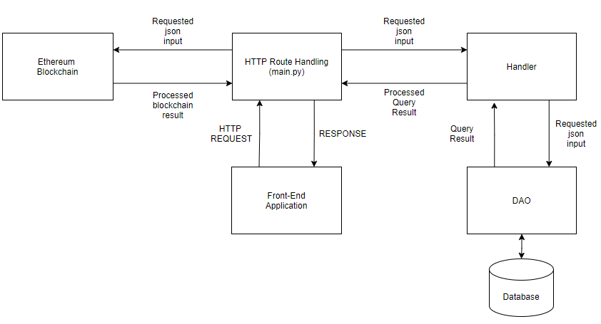
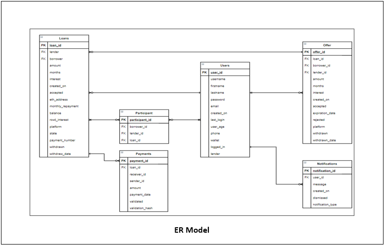

# Decentraloan

## Description

This repository will focus on the back-end, blockchain and server side implementation of our project. 

## Usage

### Installing

In order to run this program you will need to make sure that the following dependencies are installed on your system by creating a virtual environment with the dependencies in the requirements.txt file, to do so write the following commands in the terminal while inside the project directory:

```
python -m venv venv
venv\Scripts\activate
pip install -r requirements.txt
```

### Before Running main.py

It is important to define WEB3 INFURA constant variables in order to communicate with the block chain. Do this by running the ```env.bat``` file. 

### Project structure

The back-end project repository looks to follow the Model-View-Controller design model in terms of interactions between the database and the REST API. 

#### Main folders/files: 
```
CAPSTONE_APP/              # Root directory.
|- Handler/                # Handler classes in order to handle database output from the DAO class.
|- DAO/                    # Object creations in order to interact with the database.
|- images/                 # Images folder.
|- main.py                 # Responsible for hosting the server, routing and handling HTTP requests.
|- config/                 # Configuration file, used to setup the database connection credentials.
|- database_schema.sql     # Defines the table schema querries being used in the database.
|- config/                 # Configuration file, used to setup the database connection credentials.
|- contracts/              # Source Code of Ethereum Smart Contracts used for the Project.
|- build/                  # Compiled Contracts, ready to be deployed in the Blockchain.
```

### Data Access Object folder: 

Inside the Data Access Object (DAO) folder, there will exist classes for each entity that needs to fetch, store, update and delete from the Database. Most methods inside these classes follow a common occurence of creating a query based on parameters from the handler, executing the query with the cursor object that is responsable of initializing connection with the database, specified under the ```config``` folder, executing the query and once a result is received from the database, we return it.

#### Example: 

```
class UsersDAO:

    def __init__(self):

        connection_url = "dbname=%s user=%s password=%s port=%s" % (pg_config['dbname'],
                                                                    pg_config['user'],
                                                                    pg_config['passwd'],
                                                                    pg_config['port'])
        self.conn = psycopg2._connect(connection_url)

    # GET 
    def get_all_users(self):
        cursor = self.conn.cursor()
        query = 'select * from users;'
        cursor.execute(query)
        result = []
        for row in cursor:
            result.append(row)
        return result
```

### Contracts folder

This folder contain source files for smart contracts used in the Ethereum Blockchain. These contracts are written in the Solidity v8.0.0 programming language. Solidity is a simple and powerful language that is exclusively used for the development of Ethereum Smart Contracts. For this project, the main contract is DecentraLoan.sol. This contract has the structure and required methods to track a loan contract.

```
contract DecentraLoan:
    Constructor(address lender, uint amount, uint interest, uint repaymentPeriod)
    Modify(uint amount, uint interest, uint repaymentPeriod)
    Deal(address borrower, uint amount, uint interest, uint repaymentPeriod)
    Withdraw(address lender, string reason)
    SendPayment(address sender, uint paymentNumber, uint amount, string evidence)
    GetEvidence(uint paymentNumber)
    ValidateEvidence(address user, uint paymentNumber)
```

### Handler folder: 

Inside this folder there will exist classes that correspond to all entities used through the program, acting as an intermediary between the HTTP responses and the database in order to execute extensive logic if need be. 

#### Example: 

```
class UsersHandler:

    def build_user_dict(self, row):
        result = {}
        result['user_id'] = row[0]
        result['username'] = row[1]
        result['first_name'] = row[2]
        result['last_name'] = row[3]
        result['email'] = row[5]
        result['age'] = row[8]
        result['phone'] = row[9]
        result['wallet'] = row[10]
        result['lender'] = row[12]
        return result

    def get_user(self, uid):
        dao = UsersDAO()
        row = dao.get_user(uid)
        if not row:
            return jsonify(Error="User Not Found"), 404
        else:
            return self.build_user_dict(row)
```

### main.py file: 

Inside main.py is where the server routes are created and manage HTTP requests through the Python Flask framework. 

#### Example: 

```
@app.route('/api/login', methods=['POST'])
def login():
    if request.method == 'POST':
        data = request.json
        email = data['email']
        password = data['password']
        uid = UsersHandler.validate_user_login(email, password)
        lender = UsersHandler.get_user(uid).get("lender")
        wallet = UsersHandler.get_user(uid).get("wallet")
        if uid:
            return jsonify(email=email, localId=uid, status='success', wallet=wallet, lender=lender)
        else:
            return jsonify(Error="Invalid credentials."), 404

    else:
        return jsonify(Error="Method not allowed."), 405
```

## Back-End Architecture: 



## Database ER Diagram: 



## Routes API

<routes>
    
```
@app.route('/checkonline')
def check_online():
""" Verifies if the application is connected to Infura network. 

Returns:
    JSON: A json object containing: backend_eth_account, backend_eth_balance, and web3_online. 
"""


@app.route('/api/getfactory')
def get_factory():
""" Returns the connection to the DecentraLoan factory. 

Returns:
    JSON: A json object containing: abi, factory address, and the bytecode representing the factory. 
"""

    
@app.route('/users', methods=['GET'])
def get_all_users():
""" Retrieves all users in the platform from the database. 

Returns:
    JSON: A json object containing all of the users in the platform. 
"""


@app.route('/api/user', methods=['GET'])
def get_user():
""" Retrieves a user with the user_id given
in the platform from the database. 

Returns:
    JSON: The user who's user_id matches, error if the id does 
    not exist within the database. 
"""


@app.route('/api/check-emails-user', methods=['GET'])
def check_emailsUsersname():
"""Verifies the legitimacy of a input email and username. 

Returns:
    Boolean Array: Returns an array of booleans denoting 
    if the email and username are valid when true.
"""


@app.route('/api/register', methods=['POST'])
@cross_origin()
def register():
"""Upon success inserts a new user into the database. 

Returns:
    JSON: returns a JSON object denoting the new user information upon success, 
    upon failure, returns an error denoting whether the query was successful. 
"""


@app.route('/api/login', methods=['POST'])
def login():
"""Verifies user credentials passed in order to determine if a login
is valid. 

Returns:
    JSON: Returns a successful json object with user information, upon
    failure it will return an error. 
"""


@app.route('/api/edituser', methods=['PUT'])
def edit_user():
"""Verifies user credentials passed in order to determine if an edit
is valid, if so it will use the rest of the parameters and update the user
whos user_id matches with the passed parameters. 

Returns:
    JSON: Returns a successful json object with user information, upon
    failure it will return an error. 
"""


@app.route('/api/editpass', methods=['PUT'])
def edit_user_pass():
"""Verifies passed user credentials, if valid, procedes to 
update the user's password. 

Returns:
    JSON: Returns a json object with a status denoting if it 
    was successful or not. 
"""


@app.route('/api/create-loan', methods=['POST'])
def create_loan():
"""Retrieves passed request information and procedes to 
create a loan on the Decentraloan factory and the database. 

Returns:
    JSON: Returns the loan_id of the newly created loan upon success and 
    an error message upon failure of the query.
"""


@app.route('/api/loans', methods=['GET'])
def get_all_loans():
"""Retrieves all non-accepted, non-withdrawn loans from the database. 

Returns:
    JSON: returns a json object with an array of loans retrieved. 
"""


@app.route('/api/user-loans', methods=['GET'])
def get_all_user_loans():
"""Retrieves all non-accepted, non-withdrawn loans that belong to a user
with the user_id received from the database. 

Returns:
    JSON: returns a json object with an array of loans retrieved. 
"""


@app.route('/api/user-loan-count', methods=['GET'])
def get_all_user_loan_count():
"""Returns the number of loans a user has. 

Returns:
    JSON: Returns a json object with the quantity. 
"""


@app.route('/api/user-loan', methods=['GET', 'PUT'])
def get_single_user_loans():
"""Depending on the request method received, if it's a 'GET' 
it will return the loan with the 'loan_id' received. If the method 
is 'PUT' the json object will return a 'Success' response or an error
if no loan found. 

Returns:
    JSON: Returns a json object with all of the loan attributes. 
    Will return an error if no loan found with the 'loan_id' passed.
"""


@app.route('/api/update-loan-state', methods=['PUT'])
def edit_loan_state():
"""Edit a loan 'state' attribute with the state received from the call. 

Returns:
    JSON: Returns a response, 'Success' when no error found or an error
    when a loan with the given loan_id is not found. 
"""

@app.route('/api/withdraw-loan', methods=['POST'])
def withdraw_loan():
"""Withdraws the loan with the 'loan_id' received. 

Returns:
    JSON: Returns a status message upon success. It will return
    an error if the received 'loan_id' does not exist. 
"""


@app.route('/api/create-offer', methods=['POST', 'PUT'])
def create_offer():
"""Depending on the request method received, if a 'POST' method is received
it will extract the data from the received json object and procede to create 
the desired offer by the user. If a request method of 'PUT' is received, it 
will extract the data from the received json object and procede to edit the 
offer with the received 'offer_id', by replacing its values with the received
ones. 

Returns:
    JSON: Depending on the request method received, if a 'POST' method is received
    it will return a status denoting if the query succeeded or not. If the method 
    received is 'PUT' it will return a response denoting if it suceeded or not. 
    It will return an error if the 'loan_id' or 'offer_id' is not found. 
"""


@app.route('/api/pending-offers', methods=['GET'])
def get_all_user_pending_offers():
"""Retrieves all pending offers a user with the received 'user_id' 
has. 

Returns:
    JSON: A json array filled with all the user's pending offers. 
"""


@app.route('/api/total-offers', methods=['GET'])
def get_offer_count():
"""Finds out the number of offers a user has. 

Returns:
    JSON: Returns a json object with the quantity. 
"""


@app.route('/api/withdraw-offer', methods=['PUT'])
def withdraw_offer():
"""Withdraws the Offer with the 'offer_id' received. 

Returns:
    JSON: Returns a offer_id of the withdrawn offer upon success. 
    It will return an error if the received 'offer_id' does not exist. 
"""


@app.route('/api/withdraw-loan-offers', methods=['PUT'])
def withdraw_all_loan_offers():
"""Withdraws all offers that were made to a specific loan. 

Returns:
    JSON: Returns the 'loan_id' of the loan who's offers were 
    withdrawn on success. It will return an error if the loan 
    is not found. 
"""


@app.route('/api/reject-offer', methods=['PUT'])
def reject_offer():
"""Rejects an offer with the 'offer_id' received. 

Returns:
    JSON: Returns the 'offer_id' of the rejected offer. 
    It will return an error if the 'offer_id' is not found. 
"""


@app.route('/api/accept-offer', methods=['PUT'])
def accept_offer():
"""Accepts incomming offer that matches with the 
'offer_id' received and procedes to reject all other offers
the loan to whom the offer was made, set the loan as accepted 
in the block chain, and insert to the participant table both, 
lender and borrower. 

Returns:
    JSON: Returns a json object containing the initial given 'offer_id' 
    upon success. Will return an error if the offer was not found. 
"""


@app.route('/api/rejected-offers', methods=['GET'])
def get_rejected_offers():
"""Retrieves from the database all offers that are rejected. 

Returns:
    JSON: Returns a json object containing all rejected
    offers upon success. Will return an error if the 'user_id' 
    is not found. 
"""


@app.route('/api/send-payment', methods=['POST'])
def send_payment():
"""Responsable of creating a received payment from a user in the database
and adding it to the smart contract.

Returns:
    JSON: Upon success, returns the payment_id of the newly created payment. 
    It will return an error if the user with a 'user_id' or a loan with the 'loan_id' 
    is not found. 
"""


@app.route('/api/validate-payment', methods=['POST'])
def validate_payment():
"""Responsable of validating a received payment from a user in the database
and adding it to the smart contract. It also verifies if on a successful validation
the loan term has ended, if so, it will procede to formally terminate the loan. 

Returns:
    JSON: Upon success, returns a validation code used by the front-end application
    to determine which task must be made. It will return an error if the user with 
    a 'user_id' or a loan with the 'loan_id' is not found. 
"""


@app.route('/api/user-payments', methods=['GET'])
def get_all_user_payments():
"""Retrieves from the database all user payments and activity logs.

Returns:
    JSON: An array of all activity logs, including payments. Will 
    return an error if a user is not found. 
"""


@app.route('/api/loan-payments', methods=['GET'])
def get_all_loan_payments():
"""Retrieves all payments done to a loan with the received
'loan_id' argument. 

Returns:
    JSON: Returns a json object filled with an array of payments, if any,
    belonging to the loan. Will return an error if a loan is not found. 
"""


@app.route('/payments', methods=['GET'])
def get_all_payments():
"""Retrieves from the database all payments. 

Returns:
    JSON: Returns a json object containing all payments
    upon success. 
"""


@app.route('/api/get-participant', methods=['GET'])
def get_participant():
"""Checks whether the user received is a loan participant
or not. 

Returns:
    JSON: Returns a json object with the 'participant_id' upon success.
    Will return an error if no participant found. 
"""


@app.route('/api/notifications', methods=['GET', 'POST'])
def alert_user_notifications():
"""Depending on the request method, it either retrieves all notifications
belonging to the user_id passed or posts a new notification to the user 
with the user_id passed. 

Returns: 
    JSON: A object containing all the notifications a user has,
    the notification ID of the newly created notification in the case of a 
    'POST' request, an error if the user is not found or the query fails.
"""

```
</routes>


## Credits

### Luis G. Rivera Gonzalez (luis.rivera162@upr.edu) 
### Hector A. Rodriguez  (hector.rodriguez49@upr.edu) 

