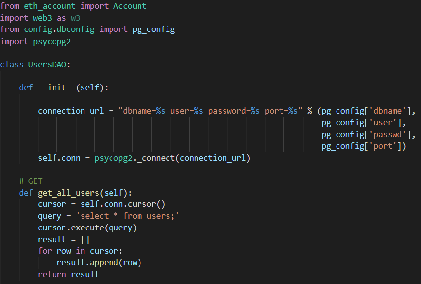
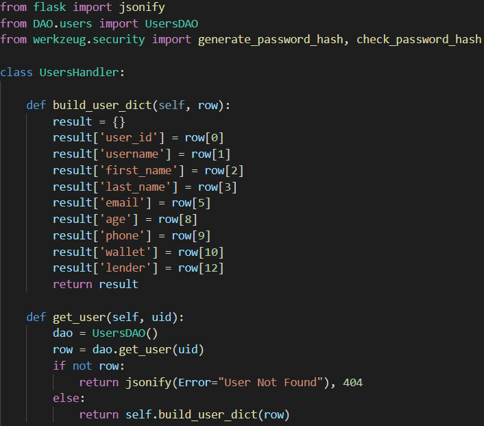
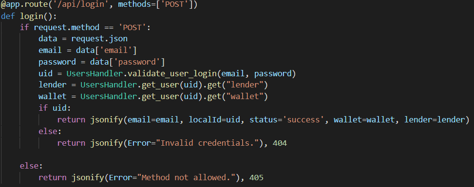

# Decentraloan

## Description

This repository will focus on the back-end, blockchain and server side implementation of our project. 

## Usage

### Installing

In order to run this program you will need to make sure that the following dependencies are installed on your system by creating a virtual environment with the dependencies in the requirements.txt file, to do so write the following commands in the terminal while inside the project directory:

```
python -m venv venv
venv\Scripts\activate
pip install -r requirements.txt
```

### Before Running main.py

It is important to define WEB3 INFURA constant variables in order to communicate with the block chain. Do this by running the ```env.bat``` file. 

### Project structure

The back-end project repository looks to follow the Model-View-Controller design model in terms of interactions between the database and the REST API. 

#### Main folders/files: 
```
CAPSTONE_APP/              # Root directory.
|- Handler/                # Handler classes in order to handle database output from the DAO class.
|- DAO/                    # Object creations in order to interact with the database.
|- images/                 # Images folder.
|- main.py                 # Responsible for hosting the server, routing and handling HTTP requests.
|- config/                 # Configuration file, used to setup the database connection credentials.
|- database_schema.sql     # Defines the table schema querries being used in the database.
|- config/                 # Configuration file, used to setup the database connection credentials.
|- contracts               # add usability
|- build/                  # add usability
```

### Data Access Object folder: 

Inside the Data Access Object (DAO) folder, there will exist classes for each entity that needs to fetch, store, update and delete from the Database. Most methods inside these classes follow a common occurence of creating a query based on parameters from the handler, executing the query with the cursor object that is responsable of initializing connection with the database, specified under the ```config``` folder, executing the query and once a result is received from the database, we return it.

#### Example: 



### Handler folder: 

Inside this folder there will exist classes that correspond to all entities used through the program, acting as an intermediary between the HTTP responses and the database in order to execute extensive logic if need be. 

#### Example: 



### main.py file: 

Inside main.py is where the server routes are created and manage HTTP requests through the Python Flask framework. 

#### Example: 



## Back-End Architecture: 


