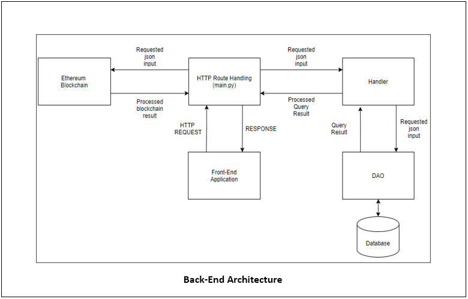

# Decentraloan

## Description

This repository will focus on the back-end, blockchain and server side implementation of our project. 

## Usage

### Installing

In order to run this program you will need to make sure that the following dependencies are installed on your system by creating a virtual environment with the dependencies in the requirements.txt file, to do so write the following commands in the terminal while inside the project directory:

```
python -m venv venv
venv\Scripts\activate
pip install -r requirements.txt
```

### Before Running main.py

It is important to define WEB3 INFURA constant variables in order to communicate with the block chain. Do this by running the ```env.bat``` file. 

### Project structure

The back-end project repository looks to follow the Model-View-Controller design model in terms of interactions between the database and the REST API. 

#### Main folders/files: 
```
CAPSTONE_APP/              # Root directory.
|- Handler/                # Handler classes in order to handle database output from the DAO class.
|- DAO/                    # Object creations in order to interact with the database.
|- images/                 # Images folder.
|- main.py                 # Responsible for hosting the server, routing and handling HTTP requests.
|- config/                 # Configuration file, used to setup the database connection credentials.
|- database_schema.sql     # Defines the table schema querries being used in the database.
|- config/                 # Configuration file, used to setup the database connection credentials.
|- contracts/              # Source Code of Ethereum Smart Contracts used for the Project.
|- build/                  # Compiled Contracts, ready to be deployed in the Blockchain.
```

### Data Access Object folder: 

Inside the Data Access Object (DAO) folder, there will exist classes for each entity that needs to fetch, store, update and delete from the Database. Most methods inside these classes follow a common occurence of creating a query based on parameters from the handler, executing the query with the cursor object that is responsable of initializing connection with the database, specified under the ```config``` folder, executing the query and once a result is received from the database, we return it.

#### Example: 

```
class UsersDAO:

    def __init__(self):

        connection_url = "dbname=%s user=%s password=%s port=%s" % (pg_config['dbname'],
                                                                    pg_config['user'],
                                                                    pg_config['passwd'],
                                                                    pg_config['port'])
        self.conn = psycopg2._connect(connection_url)

    # GET 
    def get_all_users(self):
        cursor = self.conn.cursor()
        query = 'select * from users;'
        cursor.execute(query)
        result = []
        for row in cursor:
            result.append(row)
        return result
```

### Contracts folder

This folder contain source files for smart contracts used in the Ethereum Blockchain. These contracts are written in the Solidity v8.0.0 programming language. Solidity is a simple and powerful language that is exclusively used for the development of Ethereum Smart Contracts. For this project, the main contract is DecentraLoan.sol. This contract has the structure and required methods to track a loan contract.

```
contract DecentraLoan:
    Constructor(address lender, uint amount, uint interest, uint repaymentPeriod)
    Modify(uint amount, uint interest, uint repaymentPeriod)
    Deal(address borrower, uint amount, uint interest, uint repaymentPeriod)
    Withdraw(address lender, string reason)
    SendPayment(address sender, uint paymentNumber, uint amount, string evidence)
    GetEvidence(uint paymentNumber)
    ValidateEvidence(address user, uint paymentNumber)
```

### Handler folder: 

Inside this folder there will exist classes that correspond to all entities used through the program, acting as an intermediary between the HTTP responses and the database in order to execute extensive logic if need be. 

#### Example: 

```
class UsersHandler:

    def build_user_dict(self, row):
        result = {}
        result['user_id'] = row[0]
        result['username'] = row[1]
        result['first_name'] = row[2]
        result['last_name'] = row[3]
        result['email'] = row[5]
        result['age'] = row[8]
        result['phone'] = row[9]
        result['wallet'] = row[10]
        result['lender'] = row[12]
        return result

    def get_user(self, uid):
        dao = UsersDAO()
        row = dao.get_user(uid)
        if not row:
            return jsonify(Error="User Not Found"), 404
        else:
            return self.build_user_dict(row)
```

### main.py file: 

Inside main.py is where the server routes are created and manage HTTP requests through the Python Flask framework. 

#### Example: 

```
@app.route('/api/login', methods=['POST'])
def login():
    if request.method == 'POST':
        data = request.json
        email = data['email']
        password = data['password']
        uid = UsersHandler.validate_user_login(email, password)
        lender = UsersHandler.get_user(uid).get("lender")
        wallet = UsersHandler.get_user(uid).get("wallet")
        if uid:
            return jsonify(email=email, localId=uid, status='success', wallet=wallet, lender=lender)
        else:
            return jsonify(Error="Invalid credentials."), 404

    else:
        return jsonify(Error="Method not allowed."), 405
```

## Back-End Architecture: 



## Database ER Diagram: 


## Backend Routes: 

```
# verify if connected to Infura
# return _backend_account address
@app.route('/checkonline')

# Gets all users
@app.route('/users', methods=['GET'])

# requires a user_id returns user data
@app.route('/api/user', methods=['GET'])

#gets or creates notifications returns notification or id
@app.route('/api/notifications', methods=['GET', 'POST'])

requires email and username and check if these exist in the DB
@app.route('/api/check-emails_user', methods=['GET'])

requires all info of the user, returns user_id
@app.route('/api/register', methods=['POST'])

# validates user login data and logs them in
@app.route('/api/login', methods=['POST'])

# requires data to be changed returns email user_id and the status
@app.route('/api/edituser', methods=['PUT'])

#requires new and old password and the user_id, changes the users password
@app.route('/api/editpass', methods=['PUT'])

# validates user login data and logs them out
@app.route('/api/logout')

# creates a contract for the loan created returns contract adress
@app.route('/api/create-loan', methods=['POST'])

# gets all loans
@app.route('/api/loans', methods=['GET'])

# gets loan data for a provided user_id
@app.route('/api/user-loans', methods=['GET'])

# get all the loans of a user, requires user_id 
@app.route('/api/user-loan-count', methods=['GET'])

#gets a loan from a loan_id
@app.route('/api/user-loan', methods=['GET', 'PUT'])

#create or edit an offer happening between loaner and borrower
@app.route('/api/create-offer', methods=['POST', 'PUT'])

# gets all offers or a specific user
@app.route('/api/pending-offers', methods=['GET'])

# get total number of offers
@app.route('/api/total-offers', methods=['GET'])

# creates a payment and updates/creates a contract to save this information
@app.route('/api/payment/send', methods=['POST'])

# validate that all the payment info is correct
@app.route('/api/eth/payment/validate', methods=['POST'])

# gets the loan contract to get the info
@app.route('/api/eth/loan-info', methods=['GET'])

# gets the loan contract to dela with payment data
@app.route('/api/eth/loan-payments', methods=['GET'])

# gets the loan contract to get activity and sort via timestamp
@app.route('/api/eth/loan-activity', methods=['GET'])

# gets all user payments
@app.route('/api/user-payments', methods=['GET'])

# deletes a loan
@app.route('/api/withdraw-loan', methods=['POST'])

# deletes an offer
@app.route('/api/withdraw-offer', methods=['DELETE'])

# deletes all offers on a loan
@app.route('/api/delete-loan-offers', methods=['DELETE'])

# rejects the offer
@app.route('/api/reject-offer', methods=['PUT'])

# accept the offer
@app.route('/api/accept-offer', methods=['PUT'])

# gets all rejected offers from a user
@app.route('/api/rejected-offers', methods=['GET'])

# gets all payments done
@app.route('/payments', methods=['GET'])


```


## Credits

### Luis G. Rivera Gonzalez (luis.rivera162@upr.edu) 
### Hector A. Rodriguez  (hector.rodriguez49@upr.edu) 
### Josian A. Velez (josian.velez@upr.edu) 


